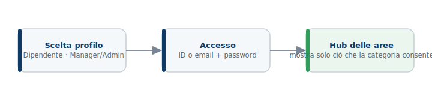
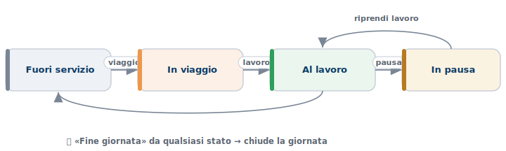
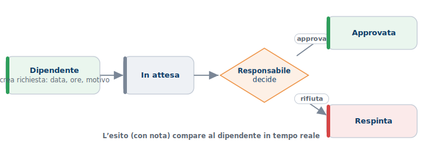
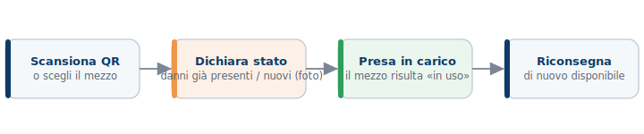
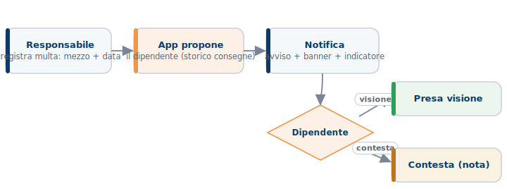
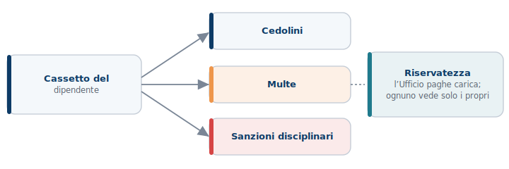
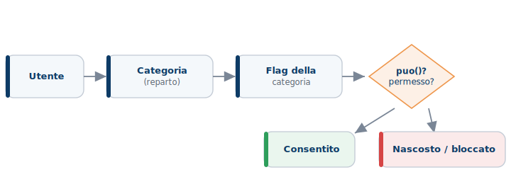
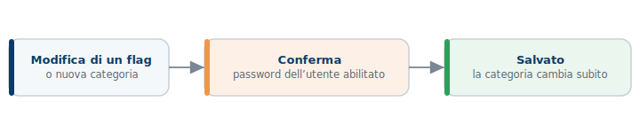

# Guida rapida — GreenEco Operations

| | |
|---|---|
| **Cos'è** | Schede sintetiche «a colpo d'occhio»: un diagramma per ogni flusso |
| **Per chi** | Tutti i profili · da tenere a portata di mano |
| **Manuali di dettaglio** | Timbrature · Sanzioni · (documenti separati) |

> Ogni riquadro è un passaggio; le frecce indicano l'ordine. **Verde** = esito/azione del dipendente · **blu** = sistema/responsabile · **arancio** = scelta o conferma · **rosso** = rifiuto/blocco.

---

## 1. Accesso

*Si sceglie il profilo, si accede con ID o email + password e si arriva all'**hub**: mostra **solo** le aree consentite dalla **categoria** dell'utente.*

---

## 2. Timbrature presenze

*Si «dichiara l'attività». «**Fine giornata**» chiude da qualsiasi stato (incluso il viaggio di ritorno). Funziona anche **senza rete**: le timbrature partono appena torna la connessione.*

---

## 3. Richieste di straordinario

*Il dipendente invia la richiesta; il responsabile **approva o respinge** (con nota). L'esito compare al dipendente **in tempo reale**.*

---

## 4. Presa in carico automezzi

*Si apre il mezzo dal **QR** (o lo si sceglie), si **dichiara lo stato** (danni già presenti + eventuali nuovi con foto), si **prende in carico** e, a fine uso, si **riconsegna**.*

---

## 5. Multe sui mezzi

*Il responsabile registra la multa (mezzo + data); l'app **propone il dipendente** dallo storico delle consegne. Il dipendente è **avvisato** e può **prendere visione** o **contestare**.*

---

## 6. Cassetto del dipendente

*Tre sezioni personali. L'**Ufficio paghe** carica cedolini e sanzioni; **ognuno vede solo i propri** documenti (archivio privato).*

---

## 7. Categorie & Permessi

*Ogni utente ha una **categoria** (reparto). I **flag** della categoria decidono cosa vede e cosa può fare: se il flag è acceso l'azione è consentita, altrimenti è nascosta.*

*Dalla pagina **«Categorie & Permessi»** (Amministratore e CEO & C) si accendono/spengono i flag e si creano nuove categorie. **Ogni modifica va confermata con la password** dell'utente abilitato.*

---

## Chi vede cosa (impostazione iniziale)

| Categoria | In sintesi |
|---|---|
| **Amministratore · CEO & C** | Tutto. Vede i **dati di tutti i reparti**; gestisce utenti, categorie e permessi. |
| **Responsabile** | **Tabelloni** e **decisioni** (straordinari, presenze, mezzi) del **proprio team**; gestisce le **multe**. Niente gestione utenti/permessi. |
| **Ufficio paghe** | Aree personali + **carica e gestisce i cassetti** dei dipendenti. |
| **Ufficio Tecnico · Operativo · Commerciale** | **Timbra**, invia **richieste straordinario**, **prende in carico i mezzi**, consulta il **proprio cassetto**. |

*Questa è solo la configurazione di partenza: ogni voce è un insieme di **flag** modificabili, e si possono **creare nuove categorie**, da «Categorie & Permessi».*
