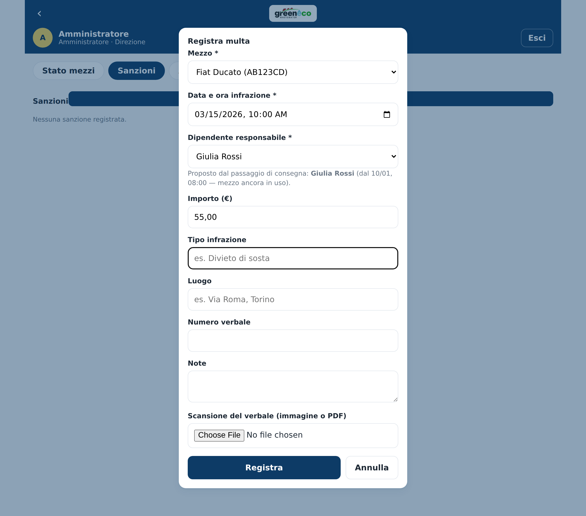
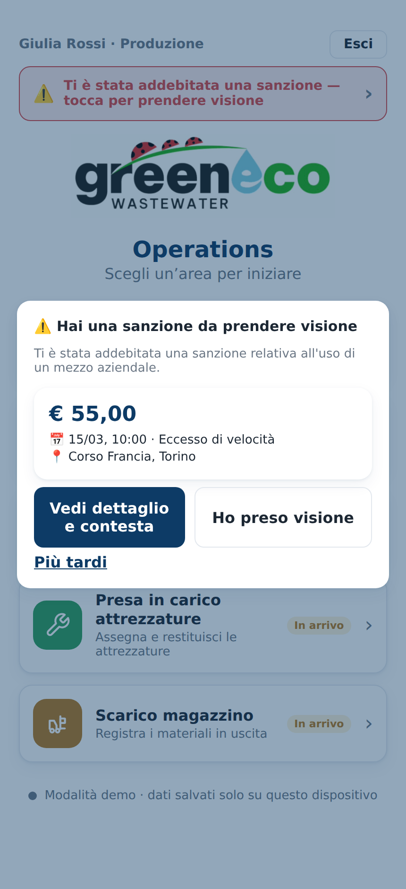
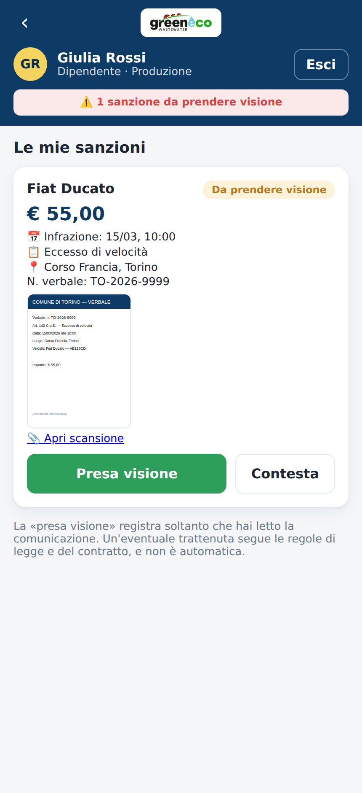

# Manuale — Sanzioni sui mezzi (addebito al dipendente)

| | |
|---|---|
| **Applicazione** | GreenEco Operations |
| **Modulo** | Automezzi → Sanzioni |
| **Destinatari** | Manager/Amministratore (registrazione) · Dipendente (presa visione) |
| **Versione documento** | 0.1 — bozza preliminare |

> Documento di supporto alla valutazione: descrive **come l'app gestisce le multe**
> addebitabili al dipendente che aveva il mezzo. La **trattenuta** vera e propria
> resta una decisione HR/paghe con i propri presupposti di legge (v. § 7).

---

## 1. Scopo

Quando un mezzo aziendale prende una multa, questa va **attribuita** al
dipendente che lo aveva in carico e **comunicata** in modo evidente. Il modulo:

- registra la sanzione e la collega a **mezzo + dipendente + data**;
- **propone in automatico** il responsabile in base allo storico dei passaggi di
  consegna;
- consente di **allegare la scansione del verbale**;
- **notifica** il dipendente e ne raccoglie la **presa visione** (o la contestazione).

---

## 2. Dove si trova

Nell'area **Presa in carico automezzi**, scheda **«Sanzioni»** (visibile a
manager e amministratore). Il dipendente vede le proprie sanzioni in **«Le mie
sanzioni»**, raggiungibile dall'avviso descritto al § 4.

---

## 3. Registrazione e attribuzione (manager)

Dal pulsante **«Registra multa»** si compila: mezzo, **data e ora dell'infrazione**,
importo, tipo, luogo, numero verbale, note e **scansione del verbale** (immagine
o PDF).

Indicati mezzo e data, l'app **propone il dipendente** che aveva il mezzo in quel
momento, ricavandolo dallo **storico dei passaggi di consegna** (modificabile a
mano). La ricerca è **mirata per mezzo e data**, senza limiti di profondità:
funziona anche per **multe arrivate mesi dopo**, purché il passaggio di consegna
sia stato registrato (v. § 6).

*Il dipendente responsabile è proposto dal passaggio di consegna; in fondo il
campo per allegare la scansione del verbale.*

---

## 4. Notifica al dipendente

La comunicazione è resa evidente su **tre canali**, finché non c'è presa visione:

- un **avviso all'accesso** (finestra) che mostra la sanzione;
- un **banner** in cima alla schermata iniziale;
- un **indicatore** nell'intestazione dell'app, sempre visibile.

*All'accesso il dipendente vede l'avviso e il banner; può aprire il dettaglio.*

---

## 5. Presa visione, allegato e contestazione

In **«Le mie sanzioni»** il dipendente vede tutti i dati, l'**anteprima della
scansione** del verbale (con link per aprirla) e può:

- **Prendere visione** — viene registrata data e ora della lettura;
- **Contestare** — con una nota (es. *«non ero io alla guida»*).

*Dettaglio con anteprima del verbale, presa visione e contestazione.*

La **presa visione non comporta alcuna trattenuta automatica**: registra
soltanto che la comunicazione è stata letta.

---

## 6. Conservazione e attribuzione «a ritroso»

Lo storico dei **passaggi di consegna non viene cancellato**: l'attribuzione di
una multa è quindi possibile anche a **distanza di mesi**. Quando verrà definita
la **politica di conservazione** dei dati (oggi non ancora formalizzata), il
suggerimento è di **conservare i passaggi di consegna almeno quanto il tempo
massimo entro cui può arrivare un verbale**, così l'attribuzione resta sempre
possibile e documentata.

---

## 7. Allegati e riservatezza

Le scansioni dei verbali (che possono contenere **dati personali**) sono
conservate in un **archivio privato**: l'app vi accede solo tramite **link
firmati a scadenza**, generati al momento della visualizzazione. Non esistono
link pubblici permanenti al documento.

---

## 8. Nota normativa (per la valutazione)

- L'app **registra, attribuisce, notifica e raccoglie la presa visione/contestazione**.
- L'eventuale **trattenuta** (rivalsa) sul dipendente segue le regole di **legge
  e di contratto** (Statuto dei Lavoratori, disciplina delle trattenute, profili
  di colpa/dolo, CCNL) e **non è un automatismo** dell'applicazione.
- Trattandosi anche di trattamento di dati personali, vanno rispettati
  **informativa** e principi del **GDPR**; la geolocalizzazione/identificazione
  del conducente va improntata a **proporzionalità** (cfr. art. 4 L. 300/1970).
